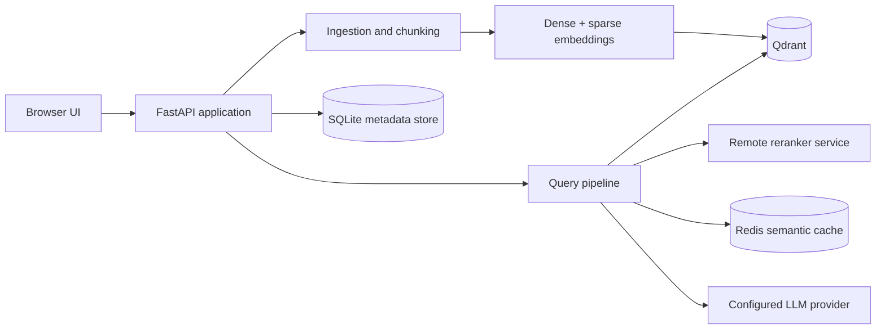

# ChatPDF

ChatPDF is a local document-question-answering application built around a hybrid retrieval-augmented generation (RAG) pipeline. It combines dense and sparse retrieval, reranking, semantic caching, document collections, request tracing, and an evaluation harness behind a FastAPI service.

The project is intended as a research and learning project for applied AI and backend engineering. It is not production-hardened: there is no authentication, tenant isolation, rate limiting, or hosted deployment configuration.

## What it demonstrates

- Hybrid dense and sparse retrieval with Qdrant.
- Optional local or remote reranking with a separate FastAPI service.
- Provider abstractions for Google and OpenAI embeddings, plus LiteLLM-backed generation providers.
- Redis semantic caching for repeated questions.
- PDF, Markdown, and plain-text ingestion with document metadata and collections.
- Request traces containing retrieval stages, timings, warnings, and source metadata.
- A small test suite covering ingestion metadata, scope filters, query behavior, the evaluator, and the static frontend.
- Docker Compose orchestration for the application, Qdrant, Redis, and reranking service.

## Architecture



The normal query path is:

1. Validate the question and any document or collection scope.
2. Check Redis for a reusable semantic-cache response when the query is unscoped.
3. Retrieve candidates with dense and sparse search.
4. Fuse and optionally rerank the candidates.
5. Generate an answer from the final context.
6. Return the answer, sources, trace metadata, timings, and warnings.

## Quick start with Docker

### Prerequisites

- Docker Desktop with Docker Compose v2.
- A Google AI API key for the default configuration, or an OpenAI API key if you switch providers.
- At least a few GB of free disk space for Docker images and the local reranker model cache.

### 1. Clone and configure the project

```bash
git clone https://github.com/rayxcast/chatpdf.git
cd chatpdf
cp .env.example .env
```

Open `.env` and set `GOOGLE_API_KEY` for the default Google configuration. Keep `.env` local; it is ignored by Git.

To use OpenAI instead, set `OPENAI_API_KEY` and change the provider and model settings shown in the comments in `.env.example`.

### 2. Build and start the services

```bash
docker compose up --build -d
```

The first build may take several minutes because the reranker service downloads its model. Follow the logs with:

```bash
docker compose logs -f app reranker_service
```

Once the services are healthy, open [http://localhost:8000](http://localhost:8000).

Useful endpoints:

- Web UI: [http://localhost:8000](http://localhost:8000)
- OpenAPI docs: [http://localhost:8000/docs](http://localhost:8000/docs)
- Service status: [http://localhost:8000/status/](http://localhost:8000/status/)

### 3. Ingest a document

The simplest path is the browser UI:

1. Optionally create a collection.
2. Choose one or more `.pdf`, `.md`, or `.txt` files.
3. Select a collection if desired.
4. Click **Ingest documents**.
5. Wait for the index status to become ready.

You can also upload through the API:

```bash
curl -sS -X POST http://localhost:8000/ingest/ \
  -F 'files=@tests/fixtures/synthetic_research_brief.md'
```

The repository includes this fictional research brief specifically for repeatable local smoke tests. It contains no private or customer data. You can substitute your own `.pdf`, `.md`, or `.txt` file when experimenting.

For a clean rebuild of the local index, add `-F 'recreate=true'`. This deletes the current Qdrant collection and local document metadata, so use it only when you intend to start over.

### 4. Ask a question

Use the UI or call the query endpoint directly:

```bash
curl -sS -X POST http://localhost:8000/query/ \
  -H 'Content-Type: application/json' \
  -d '{"question":"What is the pilot duration and primary success criterion?"}'
```

The response includes the generated answer, source metadata, and a trace describing retrieval, reranking, caching, and generation stages.

To scope a question to particular documents or collections, include their IDs:

```bash
curl -sS -X POST http://localhost:8000/query/ \
  -H 'Content-Type: application/json' \
  -d '{
    "question": "What are the key risks?",
    "document_ids": ["document-id-from-the-api"],
    "collection_ids": ["collection-id-from-the-api"],
    "top_k": 12
  }'
```

The collection and document management endpoints are available in the OpenAPI documentation. For example:

```bash
curl -sS http://localhost:8000/collections
curl -sS -X POST http://localhost:8000/collections \
  -H 'Content-Type: application/json' \
  -d '{"collection_name":"Research notes"}'
```

### 5. Stop the services

```bash
docker compose down
```

The named Docker volumes preserve Qdrant, Redis, and application metadata between restarts. To remove those volumes and re-ingest everything from scratch:

```bash
docker compose down -v
```

`down -v` is destructive for this local instance; it removes the indexed documents and metadata stored in the named volumes.

## Local development and tests

The application targets Python 3.12 and uses [uv](https://docs.astral.sh/uv/) for dependency management.

Install the development dependencies:

```bash
uv sync --extra dev
```

Run the test suite:

```bash
uv run pytest -q
```

Run lint and formatting checks:

```bash
uv run ruff check --select E4,E7,E9,F app tests
uv run ruff check tests/test_config.py tests/test_fixture_documents.py
uv run ruff format --check tests/test_config.py tests/test_fixture_documents.py
```

CI currently uses this focused lint baseline. The repository’s broader Ruff rule set has an existing style and annotation backlog that is intentionally outside this public-readiness change.

The tests are designed to exercise core behavior without requiring live provider credentials or running Docker services. End-to-end ingestion and generation still require the Compose stack and a configured provider key.

## Configuration

The main settings live in `app/config.py` and can be overridden through `.env`.

| Setting | Purpose |
| --- | --- |
| `LLM_PROVIDER`, `LLM_MODEL` | Provider and model used to generate answers. |
| `DENSE_PROVIDER`, `EMBEDDING_MODEL` | Dense embedding provider and model. |
| `EMBEDDING_DIM` | Dense vector dimension; it must match the selected embedding model. |
| `RETRIEVAL_MODE` | `hybrid` or `dense` retrieval. |
| `USE_RERANKER` | Enable or disable reranking. |
| `RERANKER_PROVIDER` | Use the Compose service (`remote`) or an in-process FastEmbed reranker (`fastembed`). |
| `USE_CACHE` | Enable or disable Redis semantic caching. |
| `QDRANT_URL`, `REDIS_URL`, `RERANKER_URL` | Service connection URLs. The Compose defaults use the service names `qdrant`, `redis`, and `reranker_service`. |
| `CHUNK_SIZE`, `CHUNK_OVERLAP` | Chunking parameters used during ingestion. |

When changing the embedding provider, model, dimension, or chunking strategy, recreate and re-ingest the index so stored vectors and metadata remain consistent.

## Evaluation status

The repository contains an experimental evaluation harness in `app/evaluation/`. It supports answerable and refusal cases, retrieval checks, and an LLM-as-judge path.

No benchmark metrics are published here. The previous generated result was removed because it was stale relative to the currently committed evaluation cases and its pass calculation did not consistently enforce every recorded check, so it was not a reliable project-level metric. Evaluation output is now ignored by Git. Reliable metrics should be added only after the dataset, scoring rules, and regression thresholds are made deterministic and independently reviewed.

To inspect the available cases without calling an LLM:

```bash
docker compose --profile eval run --rm -e EVAL_DRY_RUN=1 eval
```

Running the full evaluator requires an indexed corpus matching the selected dataset, live provider credentials, and the supporting services:

```bash
docker compose up -d qdrant redis reranker_service
docker compose --profile eval run --rm eval
```

Generated JSON is written under `eval_results/` locally and is intentionally not committed.

## Security and privacy boundaries

This is a local development and portfolio project. Do not expose the Compose stack directly to the public internet or use it with sensitive documents without adding authentication, authorization, tenant isolation, upload limits, rate limiting, secure service networking, and a documented data-retention policy.

The local stack exposes Qdrant and Redis ports on `localhost` for development convenience. Uploaded documents are processed by the application and may be sent to the configured embedding and LLM providers. Review those providers' data handling terms before using non-public content.

See [SECURITY.md](SECURITY.md) for the project’s security expectations.

## License

This project is available under the MIT License. See [LICENSE](LICENSE).
